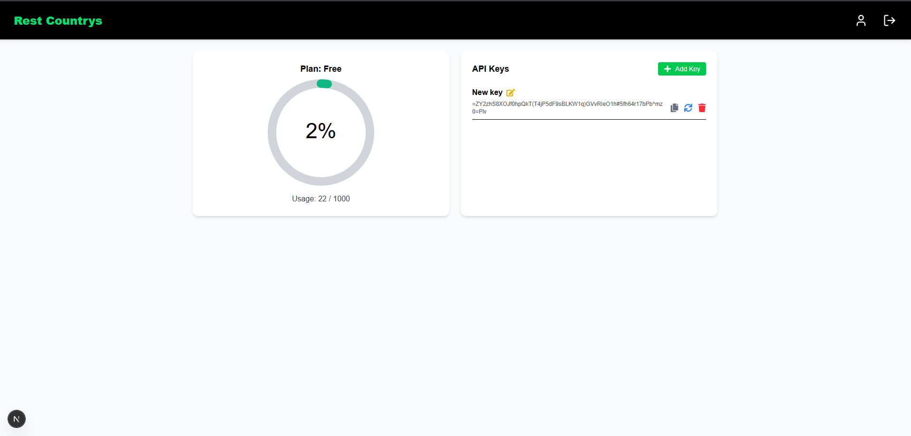
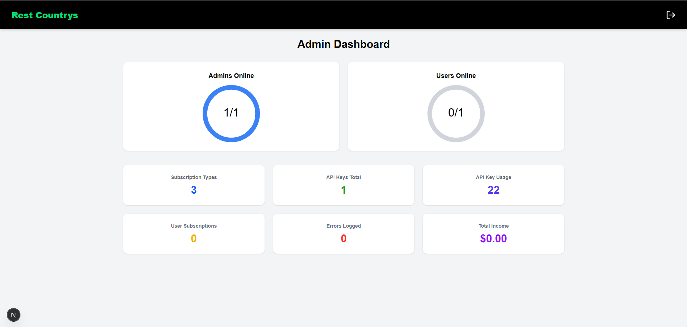

# RestCountries Secure API Middleware Service with Frontend


## Overview

This project implements a secure API middleware service that interfaces with [RestCountries.com](https://restcountries.com), a RESTful service providing detailed information about countries worldwide. The application serves as an intermediary layer, processing and filtering country data while enforcing robust security measures.

### 🔑 Key Features:
- **API Integration**: Retrieve country data (name, currency, capital, languages, flag) from RestCountries.
- **Authentication**: Complete user management system with registration, login, password hashing, and session management.
- **API Key Management**: Users can generate, rename, and delete API keys.
- **Admin Dashboard**: Admins can view total user and admin statistics, with dynamic circular meters and structured analytics.
- **User Dashboard**: Users can view their API usage, manage keys (create, regenerate, rename, delete), and track their subscription plan.
- **Frontend Interface**: Fully responsive and visually appealing frontend with smooth animations, modals, error popups, and form validations.
- **Security**: The system includes comprehensive security practices, including input validation, password hashing, and session management.
- **Containerization**: The application is fully containerized using Docker for seamless deployment.

## 🖥 Frontend Pages Overview

- **Homepage**: Showcases animated globe visual, service features, and pricing plans. Scroll animations enhance user experience.
- **User Dashboard**: Left-side navigation, usage meter, key management panel, and account settings.
- **Admin Dashboard**: Stats overview with meters and detailed control panels.
- **User Info Page**: Editable user details form with masked password updates.

## 📸 UI Snapshots

### 👤 User Dashboard


### 🛠 Admin Dashboard


---

## 📦 Project Scope

The application retrieves data from [RestCountries API](https://restcountries.com) and exposes the following country information:
- Country Name
- Currency Information
- Capital City
- Spoken Languages
- National Flag

It supports user registration, login, and API key management, with secure data storage in an SQLite or MySQL database. Dashboards for both users and admins provide full control and visibility over account usage and system stats.

---

## ⚙️ Technologies Used

- **Frontend**: Next.js, TypeScript, Tailwind CSS, Framer Motion
- **Backend**: Express (Node.js) with ECMAScript Modules (`.mjs` format)
- **Database**: MySQL (Production), SQLite (Development)
- **Caching**: Redis (Session and Cache storage)
- **Containerization**: Docker
- **Authentication**: Passport JS and Tiny CSRF
- **API Documentation**: Swagger

---

## 🚀 Setup Instructions

### Prerequisites
- Node.js (v14 or later)
- Docker
- MySQL (for production)
- Redis (for session and cache storage)

### 1. Clone the Repository

```bash
git clone https://github.com/RashmithaDeSilva/RestCountries.git
cd RestCountries
```

### 2. Run the Application

```bash
# Windows
double click run.bat

# Linux/macOS
sh run.sh dev       # Development
sh run.sh prod      # Production
sh run.sh test      # Test
```

### 3. Docker Setup

```bash
docker-compose up -d
```
This pull and runs Docker containers for the backend, frontend, Redis, MySQL (production).

---

## 🗃 Database Configuration

* Development: SQLite is used automatically.
* Production: Configure .env for MySQL:

```env
# MySQL database detals
MYSQL_DB_HOST=localhost
MYSQL_DB_USER=root
MYSQL_DB_PASSWORD=12345
DB_NAME=restcountries

# Redis session store
REDIS_SESSION_STORE_HOST=localhost
REDIS_SESSION_STORE_PORT=6379
```

---

## 📡 API Endpoints

### 🔐 Authentication & User Management
* POST /api/v1/auth/register – Register user
* POST /api/v1/auth/login – Login user

### 🧾 Country Data
* GET /api/v1/auth/restcountry – Get country info

### 🔑 API Key Management
* PATCH /api/v1/auth/user/apikey/generatenewkey
* POST /api/v1/auth/user/apikey/create
* PATCH /api/v1/auth/user/apikey/rename
* DELETE /api/v1/auth/user/apikey/delete

### 🧍 User Info
* GET /api/auth/user/info
* PUT /api/auth/user/update
* PATCH /api/auth/user/changepassword

### 🛡 Admin Dashboard
* GET /api/auth/admin/dashbord – View admin stats

---

## 🔐 Security Measures
* Password Hashing: bcrypt-secured user passwords.
* Session Management: Secure sessions using Redis.
* API Key Enforcement: Valid key required for API access.
* Input Sanitization: Prevents SQL Injection, XSS, and other attacks.
* csrf setup

---

## 🎉 Final Notes
This project delivers a full-stack secure API gateway system with user and admin dashboards, seamless API integration, and a stunning frontend. Ideal for expanding to SaaS-style country data platforms.

---
